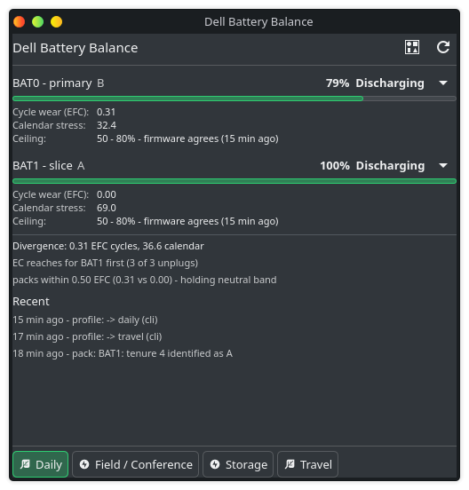
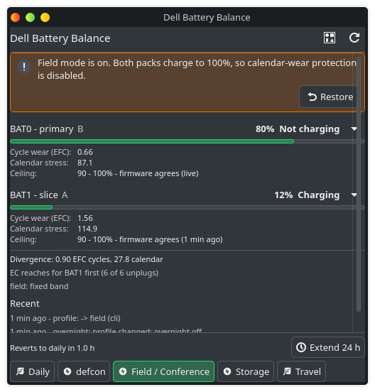
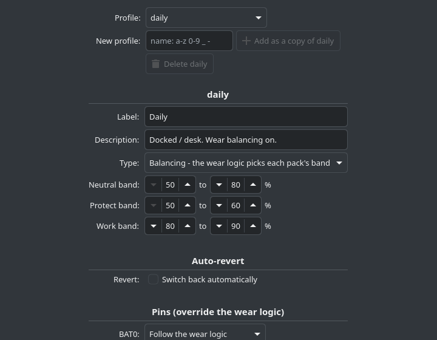
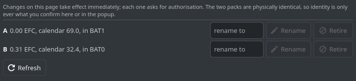
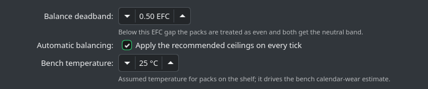

# dell-battery-balance

Wear tracking and charge-ceiling balancing for the two battery packs in a
Dell Latitude 5430 Rugged (primary + slice).

> [!IMPORTANT]
> **Built for and tested on one machine: the Dell Latitude 5430 Rugged.**
> Other Latitude Rugged models with a primary and a slice battery may work,
> but none has been tested. Feedback from
> other models is welcome; see Supported hardware below for what to check
> and what to send.

## Supported hosts

**Python 3.13 or newer is required** (argparse `--` handling differs before
it). Debian 13, Parrot and Pop!_OS with a 3.13 interpreter are the supported
hosts; Debian 12 and Ubuntu 24.04 ship an older Python and are not
supported. `install.sh` refuses to run on an older interpreter.

## Supported hardware

| | Tested |
|---|---|
| Model | Dell Latitude 5430 Rugged, primary + slice battery |
| BIOS | 1.45.0 |
| OS / kernel | Parrot Security 7.3, Linux 7.1 (`dell-wmi-sysman`, `dell-wmi-ddv` from the stock kernel) |
| Packs | Dell DRPTT67 (genuine), plus two clone-signature packs (see Packs and swapping) |
| Firmware cycle count | **Confirmed 2026-10-05**: the packs' own count, read through Dell DDV WMI with `acpi_call` (`install.sh --ddv-cycles`); the kernel's `cycle_count` is a placeholder 0 here (see Firmware cycle count) |

**Unconfirmed on anything else.** The tool depends on platform features,
not on the model name, so another model works if it has all of these:

- Two battery devices, `BAT0` (primary) and `BAT1` (slice), under
  `/sys/class/power_supply/`.
- `dell-wmi-sysman` charge attributes for both packs: `PrimaryBattChargeCfg`,
  `CustomChargeStart`, `CustomChargeStop`, `SliceBattChargeCfg`,
  `SliceBattCustomChargeStart`, `SliceBattCustomChargeStop`. Without the
  slice ones the tool can only watch BAT1, not set its ceiling.
- For recognising packs by their own identity: `dell-wmi-ddv`, which adds
  an `eppid` file to each battery. Without it every pack is asked about,
  as on 0.4.
- Optional, for the packs' own cycle count: the same DDV WMI interface
  plus the `acpi_call` module. `sudo ./install.sh` reports what the
  machine has; see Firmware cycle count.

To check a machine and report back, run these (none needs root, and none
prints a pack's serial or ePPID):

```sh
cat /sys/class/dmi/id/product_name /sys/class/dmi/id/bios_version
ls /sys/class/power_supply/ | grep BAT
ls /sys/class/firmware-attributes/dell-wmi-sysman/attributes/ | grep -i batt
ls /sys/class/power_supply/BAT*/eppid
```

Then [open an issue](https://github.com/ChiefGyk3D/dell-battery-balance/issues)
with the output, your distribution and kernel, and whether it worked. Please
don't paste the contents of `eppid` or `serial_number`: they identify your
packs, and the file names are enough. A report that it *didn't* work is
as useful as one that did.

## The problem

The embedded controller charges and discharges the two packs **sequentially,
not in parallel**. One pack ends up doing nearly all the work while the other
sits pinned near 100%. That produces two *different* kinds of wear:

| Pack | Wear mechanism |
|---|---|
| The one the EC drains first | **Cycle wear** — repeated deep discharges |
| The one left full | **Calendar wear** — Li-ion ages fastest held at high SoC, and faster still when warm |

So "one battery drains faster" is not a fault. It is the design. Evening out
the wear means stopping the idle pack from floating at 100% *and* stopping the
same pack from taking every cycle.

## Why this tool has to measure rather than read

The tool was built on two packs that shared one serial and one ePPID, the
clone pattern (see Packs and swapping), and whose **`cycle_count` still
read 0 after the tool had measured about three and four full cycles through
them**. With no working counter to query, the tool derives wear
itself, by integrating charge flow over time:

- **EFC (equivalent full cycles)** = cumulative charge out ÷ design capacity.
  This is the cycle-wear number. Integrated from `charge_now` deltas in µAh,
  so it needs no voltage estimate and is immune to voltage sag.
- **Calendar score** = hours, weighted by state of charge and temperature.
  A heuristic (SoC term rising to 4× at 100%, Arrhenius doubling per 10 °C),
  used *only* to compare the two packs against each other. Both packs are
  measured identically, so the absolute scale does not matter.

The packs do keep a real counter; the kernel just cannot see it on this
machine. The 5430 Rugged's ACPI batteries implement `_BIF`, which has no
cycle-count field, not `_BIX`, so `cycle_count` in sysfs is a placeholder 0
for every pack, genuine or not. Dell's DDV WMI interface reads the pack's
own count, and from 0.8.0 the tool can use it (see Firmware cycle count
below). EFC stays the number the balancer uses; the firmware count sits
beside it as a cross-check.

## The lever

`dell-wmi-sysman` exposes **independent** charge configuration per pack:

```
PrimaryBattChargeCfg   + CustomChargeStart / CustomChargeStop            -> BAT0
SliceBattChargeCfg     + SliceBattCustomChargeStart / ...ChargeStop      -> BAT1
```

Firmware limits: start 50–95, stop 55–100.

Lowering a pack's ceiling shifts load away from it under **either** EC
behaviour:

- If the EC drains the fuller pack first, a lower ceiling makes it lose that race.
- If the EC drains in a fixed order, a lower ceiling means it delivers fewer
  Wh before handing over.

Either way, cycles move to the other pack. That is what makes the policy safe
to run before the EC's exact behaviour is known — and the tool measures that
behaviour anyway (`EC reaches for first` in the report).

## Profiles

| Profile | Type | Bands | Notes |
|---|---|---|---|
| `daily` | balancing | neutral 50/80, protect 50/60, work 80/90 | Docked/desk default. Cannot be deleted. |
| `field` | fixed | all 90/100 | Maximum runtime, wear protection off. Auto-reverts after 72 h, or after 12 h back on AC — both adjustable or removable, see below. |
| `conference` | conference | all 90/100 by day, hold 70/80 overnight | Con week. Full by day, held overnight on AC from `night_from` (23:00), topped off in time for `leave_at` (07:00). Auto-reverts after 7 days, or after 12 h on AC once you have stopped going out daily. Or set `overnight.mode = "full"` to leave the packs at 100%. |
| `travel` | balancing | neutral 70/90, protect 60/80, work 80/95 | Reserve without the 100% float. |
| `storage` | fixed | all 50/55 | Long idle, least wear. |

A balancing profile flips a pack between `protect` and `work` once EFC
divergence exceeds `general.deadband_efc` (default 0.5) — without that
hysteresis the policy would oscillate on every tick. A fixed profile applies
the same band to both packs regardless of wear. A conference profile is a
fixed profile with an `[overnight]` table; see Conference weeks below.
Profiles, bands, pins and revert rules all live in
`/etc/dell-battery-balance/config.toml`; see
[the design doc, §1](docs/superpowers/specs/2026-09-12-profiles-packs-config-design.md#1-configuration)
for the full schema.

### Field mode, auto-revert, and why

Field holds both packs at 90–100%. That is exactly the state the rest of
this tool exists to avoid — high state of charge is the dominant
calendar-wear input, and a rugged laptop in a bag is usually warm too — so
the failure mode of field mode is forgetting to leave it. The default
revert is therefore on: 72 h covers a conference or a long weekend in the
field, and 12 h of continuous AC means you are back at a desk. You are not
locked into either:

```sh
dell-battery-balance profile field                    # same as: profile set field
dell-battery-balance profile field --for 5d           # this switch reverts after 5 days, nothing else
dell-battery-balance profile field --stay             # this switch never reverts; you change it yourself
dell-battery-balance profile edit field revert.after_hours=120
dell-battery-balance profile edit field revert.on_ac_hours=none
dell-battery-balance profile edit field revert.to=daily
dell-battery-balance profile edit field revert=none   # never revert, permanently
dell-battery-balance profile edit travel revert.after_hours=24   # any profile can revert
```

`--for` and `--stay` belong to the switch: they replace the profile's own
triggers for that switch and are forgotten on the next one. Editing
`revert.*` changes the profile for good; `none`/`off`/`0` removes a
trigger, and a table with no trigger left is removed with it. Every
privileged form above goes through `dbb-control` (`--for`/`--stay`) or
`dbb-configure` (`profile edit`), as in Usage.

### Conference weeks

Hacker summer camp is six or seven days with a hotel night in the middle
of each, and DEF CON evenings do not end when the talks do. Plain `field`
fights that twice: the 72 h trigger fires mid-week, and 12 h on hotel AC
is exactly one night, so you wake up reverted to 50/80. `field --for 8d`
stops the fight but parks both packs at 100% for every night — the
calendar wear this tool exists to avoid. The `conference` profile does
better, because the firmware can only cap charging (it cannot lower a
pack that is already full), so the saving has to come from stopping the
charge at the hold band the moment you plug in for the night:

```sh
dell-battery-balance profile create defcon --template conference   # once; any name
dell-battery-balance profile edit defcon overnight.night_from=23:00 overnight.leave_at=07:00
dell-battery-balance profile set defcon --until 2026-08-10          # or --for 8d, or --stay
```

- **By day** the profile is `field`: 90/100 on both packs. Plugging in
  before `night_from` charges to 100% — come back at 7 PM, charge, go
  back out to the CTF.
- **Inside the night window** (`night_from` to `leave_at`, default 23:00
  to 07:00) a plug-in holds both packs at `overnight.hold` (70/80). The
  tool estimates how long a full top-off takes — both packs charge one
  after the other on this EC, at the charging current it has measured,
  plus a tail and `margin_min` — and lifts the hold at `leave_at` minus
  that, so you unplug at 100%.
- **Two evening buttons** (popup or CLI) cover the nights that differ:
  `topoff now` lifts the hold and charges to 100% until you unplug (back
  out at midnight), `night` starts the hold now (an early night at
  8 PM, or a GrrCon-style week — or set `night_from = "19:00"` on a copy
  of the profile).
- **`leave-at 06:00`** is a one-off departure time for the next top-off
  (`--tomorrow` forces tomorrow's; `none` clears it); it is forgotten on
  the next profile switch. The popup has a field for it.
- **Waking for the top-off.** The tick cannot run while the laptop is
  suspended, so while holding, the tool asks the root wake helper to
  program the RTC alarm for the top-off time. The machine wakes, the
  tick lifts the hold, and — if the lid is still closed and
  `general.topoff_resuspend` is true (the default) — it goes back to
  sleep. Suspend, do not hibernate, on con nights: the RTC alarm does
  not wake a hibernated machine.
- **`overnight.mode = "full"`** keeps the profile but leaves the packs
  at 100% on AC, for anyone who would rather not have the laptop wake
  itself. The rest of the machinery is inert in that mode.

Status and the popup show the state in one line, for example
`overnight: holding 70/80, top-off 05:31 (1h29m) for 07:00`.

Three revert changes apply to every profile that reverts, not only
conference: the on-AC trigger no longer fires while you are still going
out daily (any battery stint of 30 minutes or more in the last 24 h
holds it — a hotel night never trips it, a desk trips it after a day);
an hour before any revert fires you get a `revert-warning` event (and a
notification), and `profile extend 24h` — the popup's Extend button —
pushes it out; and `--until <when>` sits next to `--for` for a date you
actually know.

## Packs and swapping

> [!WARNING]
> **Use genuine Dell packs, bought through Dell or an authorized reseller.**
> Pack recognition depends on each pack reporting its own identity. The two
> packs this tool was first developed against both reported the same serial
> (`88`) and the same ePPID, `CCDELLPN…`, which is not even in Dell's format
> (a genuine one starts with a country code and the part number, such as
> `CN0DRPTT…`). That is what counterfeit and third-party packs do: the identity data is blanked or copied from one donor pack, so every
> pack looks the same. The tool still works with packs like that, but it can
> only ask you which pack is which, never recognise one. It flags any two
> packs that report one identity. A counterfeit or unbranded pack is also
> the likeliest thing in a laptop to swell or catch fire, which matters more
> than wear tracking.

**Label each pack physically** — a sticker with the name you register it
under (`Alpha`, `Bravo`, or whatever you pick) — the moment you name it.
Even with genuine packs the first naming is yours, and a pack that reports
no identity is only ever what you say it is: a wrong `pack same` or `pack
assign` for one of those silently corrupts that pack's wear history.

### How a pack is recognised

A genuine Dell pack reports an ePPID (Dell's per-unit part and sequence
number, read through `dell-wmi-ddv` at `/sys/class/power_supply/BAT*/eppid`).
That ePPID is the pack's *fingerprint*. The serial number is deliberately
not part of it: on 2026-09-27 BAT1's `serial_number` reported BAT0's serial
for a whole session while BAT1's `eppid` stayed its own. The serial comes
through ACPI with BAT1's other readings, which have mirrored BAT0 before;
the ePPID comes through Dell's WMI interface and has not. (0.5.0 to 0.6.0
used ePPID plus serial; 0.6.1 converts stored fingerprints on its first
tick.)

- **You are asked only when the tool cannot tell.** When a pack is
  inserted, or a swap is detected, and the pack reports an ePPID, the
  question is held back while the reading confirms (two samples). Then:
  - if the fingerprint matches exactly one known pack, the slot is labelled
    as that pack, with no question;
  - if no pack, current or retired, has ever had that fingerprint, and the
    ePPID carries the pack's own Dell part number (below), the pack is
    registered as new and named automatically: the next unused name from
    Alpha, Bravo, Charlie ... Zulu. An event says so, with the rename
    command. Measured 2026-10-05: all three genuine DRPTT67 packs read
    `CN0DRPTT...` beside `model_name` `DELL DRPTT67`; the clone pair read
    `CCDELLPN...` beside `DELL NY5PG`;
  - otherwise (no part number match, a retired pack's fingerprint, clones in
    both slots), the question is asked, at the latest three samples (about
    six minutes) after the pack went in.
- A pack with no ePPID at all is asked about at once, as before 0.9.0.
- **A wrong automatic call is yours to fix**, and the fix sticks:
  `pack rename Delta Spare` renames an automatically named pack (its
  fingerprint goes with it), and `pack reassign` / `pack swap` relabel a
  slot; a label set by hand always wins over the reading (below).
- The first time you name a pack by hand, the tool learns its fingerprint
  from the slot it is in. `pack list` then shows `id read`.
- A reading must agree over **two consecutive samples** (about four minutes
  on the timer, or about 15 seconds with `dell-battery-balance check`, or
  the applet's "Check packs now" button) before it counts. A single sample is not trusted, because
  BAT1's sysfs has been measured returning BAT0's values for one sample.
  If that first reading contradicts the pack the slot is labelled with, the
  interval is credited to nobody and the labelled pack keeps its last
  reading, so a pack pulled at 28% is recorded as pulled at 28%, not at
  whatever its replacement read.
- A fingerprint that contradicts the pack the slot is labelled with means a
  swap the charge readings could not show (the new pack picked up exactly
  where the old one left off). Measured on the bench on 2026-09-26: Bravo
  out at 28%, Charlie in at 27% twelve seconds later, which is inside one
  tick and inside the charge check's tolerance; the fingerprint caught it
  on the second tick. A new tenure opens and is labelled from the
  fingerprint, or the pack is registered as new, as above. If it ends up
  asked, the guess is `different` and the applet hides its "Same" button,
  since the pack itself has said it is not the previous one.
- **Two packs reporting the same identity** are never trusted. A sample in
  which both slots read the same fingerprint never identifies either pack.
  If that lasts for 15 samples in a row (30 minutes), both packs are marked
  `id unreadable`, a warning event names the counterfeit and third-party
  pattern, and from then on those packs are asked about, never recognised.
  Real clones twin on every sample, so the wait costs nothing. It used to
  be two samples, and BAT1 mirroring BAT0's ePPID for two samples (measured
  2026-09-29 and 2026-10-02) condemned three genuine packs; 0.7.1 reads
  those packs again on its first run. Twin samples also never condemn a
  pack when either pack in the machine is already known by a different
  fingerprint: that proves a slot is being misread, not that clones met.
- Labelling a pack by hand (`assign`, `reassign`, `swap`) against what the
  slot reports is allowed; you win, and that pack's fingerprint is forgotten
  and relearned under the new label.
- `pack identity <name> show` prints the stored fingerprint, `forget` drops
  it for relearning, and `unreadable` stops the tool reading that pack's
  identity at all. Use `unreadable` for a pack you know to be a clone before
  its twin has ever sat beside it: the tool can only spot two clones when
  they are in the machine at the same time, so if they only ever take turns
  in one slot, the second would be recognised as the first.

**Setting it up** after installing 0.5.0, with the packs already named:

```sh
dell-battery-balance pack list        # a few minutes on: genuine packs show "id read"
dell-battery-balance pack identity A B unreadable   # only for packs you know are clones
```

Packs that report no identity show `id asked`; nothing to do. A new pack is
named once, when the tool asks (`dell-battery-balance pack new BAT1
Charlie`, or from the applet), and is recognised from then on.

The fingerprint is kept in `state.json`, which local users can read, as
they can the ePPID and serial in `/sys` itself. It is never written to the
sample log, the Prometheus export or `status --json`, which are the outputs
that tend to get pasted or scraped.

### Firmware cycle count

**Where the number comes from.** On the Latitude 5430 Rugged (BIOS 1.45.0)
the kernel's `/sys/class/power_supply/BAT*/cycle_count` always reads 0: the
DSDT gives both batteries `_BIF` and no `_BIX`, and `_BIF` has no cycle
count, so the kernel fills in 0. The real count is behind Dell's DDV WMI
method (GUID `8A42EA14-4F2A-FD45-6422-0087F7A7E608`, `\_SB_.AMWV.WMDV` on
this machine), the interface `dell-wmi-ddv` already reads the ePPID from.
Its call `0x0C` selects a pack through the embedded controller's battery
mailbox and returns EC word `0x3E`. The driver defines that call
(`DELL_DDV_BATTERY_CYCLE_COUNT`) but does not expose it. DDV index 1 is
BAT0 and index 2 is BAT1.

Measured 2026-10-05 against the tool's own count:

| Pack | Slot | DDV WMI count | Tool EFC | kernel `cycle_count` |
|---|---|---|---|---|
| Bravo (DRPTT67) | BAT0 | 2 | 2.46 | 0 |
| Alpha (DRPTT67) | BAT1 | 3 | 2.79 | 0 |

**Turning it on.** Calling an arbitrary WMI method from userspace needs
the `acpi_call` module, which lets root run any ACPI method. So it is
opt-in, and the service account never touches it:

```sh
sudo ./install.sh --ddv-cycles
```

This installs `acpi-call-dkms` if it is missing (on apt systems; elsewhere
install your distribution's package first), loads `acpi_call`, loads it at
boot from `/etc/modules-load.d/dell-battery-balance-acpi_call.conf`, and
reads the counts once so you see them. A plain `sudo ./install.sh` makes no
change: it prints each pack's kernel `cycle_count`, whether the DDV
interface is present, and the command above when every count reads 0.
`uninstall.sh` removes the boot-time load; it leaves the package installed.

The read is done by a third root helper,
`/usr/local/libexec/dell-battery-balance-cycles` (`ExecStartPre=+`, see
Privilege model). It does nothing unless `acpi_call` is loaded. Otherwise it
finds the DDV method from sysfs (the WMI device's object id and its parent's
ACPI path, refused unless it is a plain ACPI name), and for each slot asks
for the ePPID (`0x0D`) and the count (`0x0C`) and nothing else. A count is
written only when the ePPID at that index matches the slot's own `eppid`
file. It writes `BAT0 2`-style lines to the root-owned
`/run/dell-battery-balance-cycles/cycles`, never the ePPID. The tick uses that
file when it is under 10 minutes old and falls back to the kernel's value
otherwise.

**How it is recorded.** Each named pack's `cycle_count` is recorded the first time it is read, and
every later change is logged as a `cycles` event that puts the tool's own
count beside it:

```
Alpha: firmware cycle count 0 -> 1 (the tool counts 0.93 EFC since it first read 0)
```

`pack list` shows it as `fw`, `report` as `fw cyc`, the applet's Packs page
as "firmware: N cycles", and Prometheus as `dbb_pack_firmware_cycle_count`
next to `dbb_pack_efc_since_firmware_first`. A `-` or "unknown" means no
reading has been confirmed yet.

A reading counts only when two consecutive samples agree, the slot has no
open identity question, and, for a pack with a fingerprint, the slot's
confirmed identity is that pack's. Nothing is recorded from a sample where
both slots report one identity. Together these stop BAT1's one-sample
mirror of BAT0 from moving the wrong pack's counter. A count that goes
**down** is a `warning` event: a genuine counter only climbs, so a drop
means it was reset or the pack is not what it reports.

When a pack's count starts coming from DDV WMI, its record starts over from
that reading, with one `cycles` event (`Alpha: firmware cycle count 3, read
from the pack through Dell WMI (the kernel's cycle_count read 0)`), not a
false `0 -> 3` change. The switch also needs two agreeing samples from the
new source, since a new pack's real 0 and the placeholder 0 look the same.
Once a pack is on DDV, a stale or missing DDV reading is skipped rather than
falling back to the placeholder.

The count is kept per pack in `state.json` and is not added to the CSV
sample log, whose columns stay fixed within a year's file.

### Tenures and pending questions

Wear is tracked per *tenure* (one continuous occupancy of a slot) and rolled
up per named *pack* across every tenure it has ever held, so EFC and calendar
score for pack "A" survive it moving between BAT0 and BAT1, or sitting on the
bench.

A tenure opens whenever a slot goes from empty to occupied, or its readings
jump by more than the plausible-continuity threshold (a `charge_full` change,
or a `charge_now` discontinuity too large for the elapsed time) — either one
means "this might not be the same physical pack any more," and the tool asks
rather than assumes (unless the pack's fingerprint answers the question, as
above). `status`/`report` show a `PENDING <slot>` line, and the
applet surfaces the same question in its popup, with one of three answers:

- `pack same <slot>` — confirm it is the pack that was previously in that
  slot. Always available whenever that slot has a previous pack, whatever
  the guess; the guess (`same` when the new reading is within 3% of design
  capacity of where the previous occupant left off, with `charge_full`
  unchanged, else `unsure`; `different` when the pack's fingerprint changed)
  only labels which answer looks likely — it never restricts which answer
  you may give.
- `pack assign <slot> <name>` — identify it as an existing named pack (e.g.
  after a deliberate swap with a pack you already track).
- `pack new <slot> <name>` — register a pack seen for the first time.

`pack list` prints every known pack's EFC, calendar score, and whether it is
in a slot, on the bench, or retired, plus how long a benched pack has been
sitting and at what SoC. It also lists any pending questions. A pack removed
above ~70% SoC — poor storage practice for Li-ion — is flagged once, as a
`warning` event at removal time shown by `report`; it is not an ongoing
flag on `pack list` rows. When one bench pack
has drifted more than `general.deadband_efc` behind the most-worn inserted
pack, `status`/`report`/`pack list` print a rotation hint naming which pack
to swap in and which to pull.

Getting an answer wrong is not permanent: `pack swap` exchanges the labels
of the two inserted packs when both are wrong, and `pack reassign <tenure-id> <name>`
re-labels a specific tenure after the fact — the undo for a misidentified
`pack same`/`assign`/`new` — and moves that tenure's history to the
(possibly different) named pack. `pack rename`, `pack retire` and `pack
unretire` manage the pack roster itself; `reset --pack <name>` deletes a
pack and every tenure that ever carried it (refused while the pack is still
in a slot — take it out first).

## Install

```sh
sudo ./install.sh
```

This creates the scoped `dell-battery-balance` system account, installs the
package to `/usr/local/lib/dell-battery-balance`, the launcher, the two
privilege wrappers and the grant script to `/usr/local/libexec`, the udev
rule and both polkit actions, and the systemd unit + timer — then enables
`dell-battery-balance.timer` immediately (tick every 2 minutes; ticks sample
unconditionally and apply the resolved profile's bands whenever
`general.auto_balance` is true, which is the default).

Add `--ddv-cycles` to also read each pack's own cycle count through Dell
WMI (installs and loads `acpi_call`; see Firmware cycle count). Without it,
the installer only reports whether this machine needs it.

```sh
sudo ./uninstall.sh            # leaves /etc and /var/lib in place
sudo ./uninstall.sh --purge    # also removes config and state
```

## Upgrading from 0.1 (the root-run install)

Re-running `sudo ./install.sh` on a machine that already has the older,
root-run 0.1 layout is safe and upgrades in place. Exactly what it does to
an existing install:

- Disables and removes `dell-battery-balance-sample.{service,timer}` and the
  old single `com.chiefgyk3d.dellbatterybalance.policy` polkit action — the
  0.1 layout that this scoped-account model replaces.
- Creates the `dell-battery-balance` service account (skipped if it already
  exists from a previous run).
- Re-owns `/var/lib/dell-battery-balance` to `dell-battery-balance:dell-battery-balance`.
  `state.json` and the sample-log CSVs are preserved — only ownership and mode
  change, never the content.
- Installs `/etc/dell-battery-balance/config.toml` from the shipped default
  only if no config file is already present; an existing config.toml,
  including any custom profiles, is left untouched.
- Upgrades the Plasma applet in place (`kpackagetool6 ... --upgrade`, falling
  back to `--install` only if it was never installed).
- Enables `dell-battery-balance.timer` (replacing the old sample timer).
- An existing single `samples.csv` from 0.1 is left in place but no longer
  appended to — new samples go to `samples-YYYY.csv`, one file per calendar
  year, from the first sample after upgrading.

## Usage

Read-only commands run as any user — state and config are group/world
readable:

```sh
dell-battery-balance status          # wear summary
dell-battery-balance report          # + firmware config and recommendation
dell-battery-balance profile list
dell-battery-balance profile show daily
```

Commands that change anything (switch profiles, apply ceilings, name or
mark packs, edit configuration) are typed the same way. Run as your own
user, the tool re-runs itself as the `dell-battery-balance` service account
through the right polkit-gated wrapper, and polkit asks for your password:

```sh
dell-battery-balance field                           # your password
dell-battery-balance pack new BAT1 Charlie           # your password
dell-battery-balance pack identity A B unreadable    # admin password
```

It prints the exact `pkexec` command before running it. Under the hood that
is one of two wrappers, which the applet calls directly and which still
work typed out in full:

```sh
pkexec --user dell-battery-balance /usr/local/libexec/dbb-control profile set travel
pkexec --user dell-battery-balance /usr/local/libexec/dbb-control field
pkexec --user dell-battery-balance /usr/local/libexec/dbb-control restore
pkexec --user dell-battery-balance /usr/local/libexec/dbb-control balance --apply
pkexec --user dell-battery-balance /usr/local/libexec/dbb-configure config set general.deadband_efc=0.4
pkexec --user dell-battery-balance /usr/local/libexec/dbb-configure profile create trip --from travel
```

The re-run happens only for a user who is neither root nor the service
account, never for a read-only command (`status`, `report`, `profile
list/show`, `config get/validate`, `pack list`, `pack identity … show`,
`balance` without `--apply`), and never when `DBB_STATE_DIR`,
`DBB_CONFIG_DIR` or `DBB_SYSFS_ROOT` points the tool at a private tree. If
`pkexec` or the wrapper is missing it exits 3 and prints the `sudo` form.

`dbb-control` refuses configure-class subcommands — `config set/apply/validate`,
`profile create/edit/delete`, `reset`, `pack reassign/swap/rename/retire/unretire/identity`
— with exit 3; `config get`, `pack list/assign/new/same`, and everything else
above stay control-class. See Privilege model below.

Plain `sudo dell-battery-balance …` also works — root can do everything —
but leaves files it creates root-owned. Since 0.3 the state directory is
setgid and files are group-writable, so a stray root run no longer locks
the service account out; prefer `sudo -u dell-battery-balance
dell-battery-balance …` or the wrappers all the same.

If a BIOS admin password is set, point `general.bios_password_file` at a
file readable only by the service account; the tool never takes it as an
argument or environment variable. The grant script's gate for this is a
plain-text match against `config.toml`, so `bios_password_file` must be
written as a bare key under `[general]` (`bios_password_file = "/path"` on
its own line, which is what `config set`/`config apply` always produce) —
not the dotted `general.bios_password_file = "/path"` form, which the gate
does not recognize even though it is valid, equivalent TOML.

### CLI reference

| Command | What it does |
|---|---|
| `tick` | sample, evaluate reverts, apply if `auto_balance` is on (or a revert fired) — what the timer runs |
| `check [--wait SECONDS]` | don't wait for the timer: two ticks `--wait` seconds apart (5-300, default 15), then the pack table. Two because an identity needs two agreeing readings; after a swap, this settles it in one command |
| `sample` | one measurement, no policy |
| `status [--json \| --prometheus]` | wear summary; `--json` is the machine-readable view the applet consumes, `--prometheus` the text every tick writes to `metrics.prom` |
| `report` | `status`, plus events, firmware read-back, and the current recommendation |
| `balance [--apply]` | resolve the active profile's bands; dry run unless `--apply` |
| `profile list` | show all profiles, marking the active one |
| `profile show <name>` | print one profile's TOML |
| `profile <name>` | shortcut for `profile set <name>` |
| `profile set <name> [--for <duration> \| --until <when> \| --stay]` | switch profiles and apply immediately; `--for` reverts after that long, `--until` at a local date/time (`2026-08-10`, `2026-08-10 07:00`, `07:00`), `--stay` never — any of them replacing the profile's own triggers for this switch |
| `profile create <name> --from <name> \| --template <builtin>` | clone an existing profile, or start from a shipped default (`conference`, `field`, `travel`, `storage`, `daily`) that an older config.toml may not have |
| `profile edit <name> key=value ...` | change one profile's fields; `revert=none` or `revert.after_hours=none` remove auto-revert; `overnight=default` adds the conference table to a fixed profile, `overnight.<key>=…` edits it, `overnight=none` removes it |
| `profile delete <name>` | remove a profile (not `daily`, not the active one) |
| `profile extend <duration>` | push the active profile's auto-revert out by that long (the on-AC clock restarts too); refused when nothing would revert |
| `config get [key] [--json]` | print the whole config or one dotted key; `--json` is what the applet's config dialog reads |
| `config set key=value ...` | change `general.*` or `profiles.*` fields |
| `config validate [--json] <path>` | check a candidate file without writing anything |
| `config apply [--json] <path>` | replace the whole config from a TOML file, or with `--json` a JSON document of the same shape (must be complete and valid) |
| `field [--for <duration> \| --until <when> \| --stay]` | alias: `profile set field` |
| `restore` | alias: `profile set <previous_profile>` |
| `topoff now` | conference profile: lift the overnight hold now, charge both packs to 100% and stay there until unplugged — for going back out to the CTF |
| `night` | conference profile: in for the night — start the hold now instead of waiting for `night_from` |
| `leave-at <HH:MM \| none> [--tomorrow]` | conference profile: one-off departure time for the next top-off (the next occurrence of HH:MM; `--tomorrow` forces tomorrow's); `none` goes back to the profile's `leave_at` |
| `pack list` | list known packs (EFC, calendar score, firmware cycle count, identity, slot/bench/retired) and any pending identity questions |
| `pack assign <slot> <name>` | identify the pack in `<slot>` as an existing named pack |
| `pack new <slot> <name>` | register the pack in `<slot>` as a brand-new named pack |
| `pack same <slot>` | confirm the pack in `<slot>` is the one that was previously there |
| `pack reassign <tenure-id> <name>` | re-label one tenure's history to a (possibly different) pack — the undo for a wrong `assign`/`new`/`same` |
| `pack swap` | exchange the labels of the packs in BAT0 and BAT1 — the repair for a pair that got mislabeled |
| `pack rename <old> <new>` | rename a pack |
| `pack retire <name>` | mark a pack retired (must not be in a slot) |
| `pack unretire <name>` | un-retire a pack |
| `pack identity <name>... <show \| forget \| unreadable>` | show one or more packs' learned fingerprints, forget them so they are relearned, or never read those packs' identity (for known clones) |
| `reset --slot <SLOT> \| --pack <NAME> \| --all` | clear counters for one slot, delete a bench pack and its tenures, or reset everything |

## Privilege model

Root runs three small helpers after install. The first is a ~15-line grant script,
`/usr/local/libexec/dell-battery-balance-grant`. Everything that parses
config, evaluates policy, or writes a firmware value runs as a scoped system
account, `dell-battery-balance` (`--system`, `nologin`, no other members —
not even the interactive user).

The grant script `chgrp`s and `chmod`s exactly eight sysfs files to the
service group — the six `dell-wmi-sysman` charge-config attributes plus
BAT0's two `charge_control_*` thresholds — and a ninth,
`Admin/current_password`, only when `bios_password_file` is set. It touches
nothing else and is idempotent. Sysfs permissions do not survive a reboot,
so it runs twice over: via `ExecStartPre=+` on every tick (self-healing every
2 minutes) and via `/etc/udev/rules.d/90-dell-battery-balance.rules` when the
`dell-wmi-sysman` or `BAT0` device appears, so it's also correct for the
first applet click after a fresh boot.

Clearing `bios_password_file` does not revoke the group grant on
`Admin/current_password` until the next reboot (sysfs permissions are reset
then) or until the grant script is edited and the file is `chmod`ed back
manually in the meantime.

A second root step, `/usr/local/libexec/dell-battery-balance-wake`
(`ExecStartPost=+`), programs the RTC wake alarm the tick asked for
(`wakealarm` in the state directory), clears only alarms it set itself
(`wakealarm.set`, its proof of ownership, is root-owned and lives in
`/var/lib/dell-battery-balance-wake` — a directory outside the
service-writable state directory, so the service account can neither forge
nor clear an alarm), and after a wake it caused puts the machine back to
sleep if the lid is closed and `general.topoff_resuspend` is true. It reads
32 bytes, accepts only an integer at most 24 h ahead, never follows a
symlink planted at the marker path, and touches nothing else.

A third, `/usr/local/libexec/dell-battery-balance-cycles`
(`ExecStartPre=+`), exists only for the opt-in firmware cycle count and
exits at once unless root loaded `acpi_call`. `acpi_call` can run any ACPI
method, so `/proc/acpi/call` stays root-only and the service account never
gets it. The helper takes no input from the service: it makes two fixed DDV
WMI calls per slot (ePPID and cycle count), writes only integers to a
root-owned directory under `/run`, and refuses a DDV device whose ACPI path
is not a plain ACPI name.

Two polkit actions gate the two wrappers used above:

| Action | Wrapper | Used for | Default prompt |
|---|---|---|---|
| `com.chiefgyk3d.dellbatterybalance.control` | `dbb-control` | `config get`, `profile set`, `field`, `restore`, `balance --apply`, `pack list/assign/new/same` | the user's own password, kept (`auth_self_keep`) |
| `com.chiefgyk3d.dellbatterybalance.configure` | `dbb-configure` | `config set/apply/validate`, `profile create/edit/delete`, `reset`, `pack reassign/swap/rename/retire/unretire/identity` | admin password, kept (`auth_admin_keep`) |

`control` deliberately still prompts: a profile switch can park both packs
at 100% for days, the exact harm this tool exists to prevent. To loosen it
to no prompt at all, add a rule to `/etc/polkit-1/rules.d/` that resolves
`com.chiefgyk3d.dellbatterybalance.control` to `polkit.Result.YES`. That
cannot be used to sneak a configuration write past the `configure` action —
the tool itself rejects a configure-class subcommand under
`--polkit-class control` with exit 3, regardless of what polkit allowed, and
refuses outright (exit 3, before even parsing the command) if
`--polkit-class` appears more than once — the wrappers pin it once and pass
`--` before the rest of `"$@"`, so argparse's "last occurrence wins" behavior
cannot be used to swap `control` for `configure` after the fact: a repeated
`--polkit-class` is rejected outright, and the top-level parser also sets
`allow_abbrev=False` so the flag cannot be smuggled in under a
prefix-abbreviated spelling either.

### Verify

```sh
sudo ./install.sh
id dell-battery-balance
stat -c '%A %U:%G %n' /sys/class/firmware-attributes/dell-wmi-sysman/attributes/SliceBattCustomChargeStop/current_value
systemctl status dell-battery-balance.timer
sudo -u dell-battery-balance dell-battery-balance status
pkexec --user dell-battery-balance /usr/local/libexec/dbb-control profile set travel
pkexec --user dell-battery-balance /usr/local/libexec/dbb-control config set general.deadband_efc=0.4
    # must fail, exit 3 -- config set is configure-class
pkexec --user dell-battery-balance /usr/local/libexec/dbb-control --polkit-class configure config set general.deadband_efc=0.4
    # must fail (exit 2 or 3) and leave the value unchanged -- the second
    # --polkit-class cannot override the class the wrapper already set
sudo journalctl -u dell-battery-balance.service -n 5
ls -l /etc/systemd/system | grep dell-battery
    # after an upgrade from 0.1: only dell-battery-balance.{service,timer} --
    # no leftover dell-battery-balance-sample.{service,timer}
dell-battery-balance status
    # after an upgrade: EFC/calendar-score numbers match what they were
    # pre-upgrade -- state.json was preserved, not reset
dell-battery-balance --version
    # 0.6.0
dell-battery-balance pack list
    # no prompt: read-only. Genuine Dell packs show "id read" a few minutes
    # after install; a pack with no identity shows "id asked"
dell-battery-balance profile set daily
    # prints "asking for authorisation: pkexec --user dell-battery-balance
    # /usr/local/libexec/dbb-control profile set daily" and prompts
ls /usr/share/knotifications6/dell_battery_balance.notifyrc
dell-battery-balance config get --json | python3 -m json.tool > /dev/null
```

## Plasma applet

A Plasma 6 tray widget lives in `plasmoid/`. It sits next to the battery icon
and shows each pack's EFC and calendar score, the measured EC drain order, the
active policy, and buttons for Balance / Field / Restore, plus "Check packs
now" (the battery icon in the header), which runs `check`: two readings
about 15 seconds apart instead of waiting for the timer. Any pending pack
identity questions (see Packs and swapping above) surface in the popup too,
with buttons to answer them, since they show up in `status --json`'s
`pending` field the same way they do on the CLI. Privileged actions go
through `pkexec` against the two polkit actions above, so no terminal and no
passwordless sudo is needed.

The applet on its own is not enough: `pkexec` selecting the right polkit
action depends on the wrappers, the two `.policy` files, the grant script and
the scoped account all being in place together, so there is no supported
"just the applet, by hand" path — run:

```sh
sudo ./install.sh
```

It installs the service account, grant script, udev rule, both polkit
actions, and the applet, in one pass. After editing the applet's own files
(`plasmoid/package/`), re-push just that piece:

```sh
kpackagetool6 --type Plasma/Applet --upgrade plasmoid/package
```

Then: right-click the panel or system tray, Add Widgets, search for
"Dell Battery Balance". Left-click the icon for the popup; right-click →
Configure for the dialog. Test it standalone with
`plasmawindowed com.chiefgyk3d.dellbatterybalance` — but note that a
windowed applet is always expanded and reads config from its own file, so
it cannot show a broken click handler or a broken config default;
`tests/test_applet_package.py` guards the two such mistakes found so far
(no XML comments in `contents/config/main.xml`, expansion toggled on the
root item), and plasmashell must be restarted after
`kpackagetool6 --upgrade` for a panel instance to pick the new files up.

Field mode is flagged in two places on purpose — a red dot on the tray icon
and a warning banner in the popup — because it disables the calendar-wear
protection and is otherwise easy to leave on by accident. For a conference
profile, the banner is followed by an overnight line and its three controls
— Top off now, In for the night, and a Leaving at field — and, whenever the
active profile is within an hour of an auto-revert, an Extend button sits
next to the revert countdown.

<p align="center">
  
</p>
<p align="center">
  
</p>

### Configuring from the applet

Right-click the widget → Configure. Four pages:

- **Display** — text beside the icon (none / profile label / EFC
  divergence; only visible when the widget sits in a panel, the system tray
  keeps items icon-only), poll interval, whether pack details start
  expanded, and whether to raise notifications. Saved in the applet's own
  KConfig.
- **Profiles** — pick a profile, add one as a copy, delete one (`daily` and
  the active profile are protected), and edit its label, type (balancing,
  fixed or Conference), bands, auto-revert triggers, per-slot pins, and —
  for the Conference type — the overnight fields (mode, `night_from`,
  `leave_at`, hold band, margin).
- **Packs** — rename, retire or un-retire packs, and answer pending identity
  questions. Each pack's row says whether it is recognised by its own
  identity, has none, or was marked unreadable (see How a pack is
  recognised).
- **General** — balance deadband, automatic balancing, bench temperature.

<p align="center">
  
</p>
<p align="center">
  <br>
  
</p>

Profiles and General edit a working copy and submit the *whole* config on
Apply/OK through the configure-class polkit action, so one polkit prompt
per apply. The candidate is staged as a JSON file under `/tmp` (mode 644,
removed straight after; it carries no secrets) because the service account
cannot read the user's runtime directory. The tool validates before
installing and refuses on any error; use **Apply** rather than OK to see
the error message, since OK closes the dialog. Packs actions run
immediately, one prompt each.

### Notifications

The applet raises a desktop notification once per state event for: a
pending pack identity question, an auto-revert firing, a firmware
read-back mismatch, a pack removed above 70%, a reverting profile within
an hour of reverting (`revert-warning`), and the conference profile's
timed top-off starting. They come from the applet (root has no session
bus), so they need the widget running and lag by at most one poll
interval. The event definitions live in
`/usr/share/knotifications6/dell_battery_balance.notifyrc`, which
`install.sh` places — re-run `sudo ./install.sh` when upgrading from 0.2,
then restart the shell so the applet package reloads:

```sh
systemctl --user restart plasma-plasmashell.service
```

Notification sounds/popups per event are configurable in System Settings
→ Notifications → Application-specific → Dell Battery Balance.

## State

Durable data lives in `/var/lib/dell-battery-balance`, owned
`dell-battery-balance:dell-battery-balance` (`2775`, files `0664`) so the
applet can read them without privilege and a stray `sudo` run's root-owned
files stay group-writable by the service account (the directory's setgid
bit keeps new files in the service group):

- `state.json` — cumulative counters: per-slot tenures, the named-pack
  registry, and everything else in the schema. Currently version 2.
  A version-1 file (the pre-registry, per-slot-only layout from 0.2) is
  migrated automatically the first time anything *writes* state (`sample`,
  `tick`, ...); it is a one-way, in-place upgrade — the two slots become
  packs "A" and "B" — and read-only commands like `status`/`report` load
  and display the migrated data without rewriting the file until then.
- `samples-YYYY.csv` — raw sample log, one file per calendar year (UTC), so
  the wear model can be recomputed or re-derived later if the heuristics
  change without ever-growing files. Roughly 36 MB per year at the 2-minute
  cadence; `general.sample_log_years` (default 3, counting the current
  year) is how many years' files are kept — older ones are deleted by
  `tick`, each deletion logged as a `log` event. The key is optional, so a
  config written by 0.3.0 keeps loading; `config set
  general.sample_log_years=10` to keep more.
- `metrics.prom` — the Prometheus text exposition of `status`, rewritten
  atomically on every tick (see Monitoring below).
- `state.lock` — held (`flock`) across every command that rewrites
  `state.json`, so the timer's tick, a manual `check` and a `pack ...` edit
  wait for each other instead of one silently undoing the other. Read-only
  commands never take it.
- `wakealarm` — the epoch the conference profile wants the machine woken at
  for its top-off, rewritten every tick (empty when nothing is pending).

The wake helper's own ownership marker, `wakealarm.set`, is **not** kept
here: it lives in `/var/lib/dell-battery-balance-wake` (root:root, `0755`,
created by install.sh and by the helper itself if missing) — a directory the
service account cannot write to, so it can neither forge nor clear an alarm
the helper set.

Events carry an `id` (monotonic, never reused) since 0.3; a 0.2 state file
gets its existing events numbered once on first load. `reset --all` keeps
the id sequence running rather than restarting it, so an applet that has
already notified past a given id never re-notifies just because the state
was reset.

Configuration lives in `/etc/dell-battery-balance/config.toml`, owned
`root:dell-battery-balance` (directory `2775`, file `0664`) so `config
set`/`config apply`, run as the service account through `dbb-configure`, can
write it. After the first `config set` (or `config apply`), the file itself
becomes owned `dell-battery-balance:dell-battery-balance` — the group write
in `0664` is what let the service account replace it, and the replacement it
writes is naturally owned by whoever wrote it. Group permissions are
unaffected; `dbb-configure` keeps working the same way afterward.

### Monitoring

Every tick rewrites `/var/lib/dell-battery-balance/metrics.prom` in the
Prometheus text format, and `status --prometheus` prints the same text on
demand. The numbers are rendered from the same view `status --json` and the
applet use, so a dashboard never disagrees with the popup. Nothing listens
on a port: point node_exporter's textfile collector at the file, either by
symlinking it into the collector directory or by naming the state directory
itself:

```sh
sudo ln -s /var/lib/dell-battery-balance/metrics.prom /var/lib/node_exporter/textfile_collector/dell_battery_balance.prom
# or: node_exporter --collector.textfile.directory=/var/lib/dell-battery-balance
```

The file is world-readable (`0664` in a `2775` directory) so node_exporter
needs no group membership. Series, all prefixed `dbb_`:

| Family | Labels | What |
|---|---|---|
| `dbb_pack_efc`, `dbb_pack_calendar_score` | `pack` | the two wear numbers per named pack, across every tenure (the calendar score includes the bench estimate) — the long-run curves worth charting |
| `dbb_pack_firmware_cycle_count`, `dbb_pack_efc_since_firmware_first` | `pack` | the pack's own counter, as last confirmed, and the tool's EFC since that counter was first read: chart the two together to see whether they track |
| `dbb_pack_in_slot` / `dbb_pack_bench_hours`, `dbb_pack_bench_soc_percent`, `dbb_pack_retired`, `dbb_pack_tenures` | `pack` (+ `slot`) | where each pack is |
| `dbb_divergence_efc`, `dbb_divergence_calendar_score` | | what the balancer compares against `deadband_efc`; absent unless both slots are occupied |
| `dbb_slot_present`, `dbb_slot_capacity_percent`, `dbb_slot_power_watts`, `dbb_slot_voltage_volts`, `dbb_slot_temperature_celsius`, `dbb_slot_health_percent`, `dbb_slot_status`, `dbb_slot_pack_info` | `slot` (+ `status` / `pack`) | live readings per slot; only `present` is emitted for an empty slot |
| `dbb_slot_ceiling_start_percent`, `dbb_slot_ceiling_stop_percent`, `dbb_slot_firmware_error`, `dbb_slot_role` | `slot` (+ `role`) | what the firmware reports after the last apply, and the role the policy gave the slot |
| `dbb_slot_tenure_efc`, `dbb_slot_tenure_calendar_score`, `dbb_slot_mean_soc_percent`, `dbb_slot_time_ge90_percent`, `dbb_slot_in_slot_hours` | `slot` | the current tenure alone |
| `dbb_profile_info`, `dbb_field_mode`, `dbb_ac_online`, `dbb_pending_questions`, `dbb_config_error`, `dbb_info` | `profile`,`type` / `version` | state of the tool itself |
| `dbb_unplug_sessions_total`, `dbb_drain_first_total` | (`slot`) | counters behind the "EC reaches for first" line |
| `dbb_overnight_phase`, `dbb_topoff_start_timestamp_seconds`, `dbb_leave_timestamp_seconds`, `dbb_revert_warning` | `phase` | the conference profile's overnight phase (one-hot), when the top-off starts and the departure it targets; 1 while the active profile reverts within the hour |

Values that are unknown (an absent pack's temperature, a failed read-back's
ceiling) are left out of the file rather than written as a placeholder, so
a missing series means "not known", never zero. A failure to write the file
is a warning on the tick's stderr, never a failed tick.

## Roadmap

Usage profiles (daily / field / travel / storage / custom), the system-wide
`config.toml`, safe auto-revert out of field mode, the scoped service
account, and the pack registry that tracks wear per physical pack across
swaps and rotations (with confirm-on-swap identity) are all implemented, per
[docs/superpowers/specs/2026-09-12-profiles-packs-config-design.md](docs/superpowers/specs/2026-09-12-profiles-packs-config-design.md).
The applet's config dialog and notifications landed in 0.3, completing the
spec. 0.3.1 closed the follow-ups (`pack swap`, the two-sample removal
guard, `--for` as a true override) and added the Prometheus export and
sample-log retention. 0.4.0 added the conference profile (overnight hold,
timed top-off through an RTC wake, quick actions), and the revert changes
every reverting profile gets (the still-going-out guard, the hour-out
warning with `profile extend`, `--until`), per
[docs/superpowers/specs/2026-09-14-conference-overnight-design.md](docs/superpowers/specs/2026-09-14-conference-overnight-design.md).
0.5.0 reads pack identity: genuine Dell packs report distinct ePPIDs and
serials, and a named pack is recognised from then on (see How a pack is
recognised). 0.6.0 records each pack's firmware `cycle_count` against the
tool's EFC, to find out whether genuine packs keep a working counter.
They do, but the kernel shows a placeholder 0 on this machine; 0.8.0 reads
the packs' real count through Dell DDV WMI (opt-in, `install.sh
--ddv-cycles`). Exposing that call in `dell-wmi-ddv` itself, so no
`acpi_call` is needed, is the upstream follow-up. 0.9.0 stops asking
about packs it can recognise or vouch for: known packs are labelled
silently, and new genuine packs are registered and named automatically.
Nothing is queued; new work starts from an issue.

## Known limits

- **Pack identity is read only from packs that have one.** Genuine Dell
  packs report a distinct ePPID and serial, and once named are recognised
  on their own. Counterfeit and third-party packs typically report a blank
  or shared identity (the tool's first two packs both read serial `88` with
  one ePPID), so for those a swap is detected heuristically (a
  `charge_full` change or an implausible `charge_now` jump) and the tool
  asks. A swap of such packs that happens to look continuous (same design
  capacity, charge picked back up close to where it left off) can still be
  missed; `pack reassign` fixes a tenure that was mislabeled this way.
- **Clones that never meet cannot be told apart.** Two packs sharing one
  identity are caught only when both sit in the machine together for 15
  samples (30 minutes). Mark a known clone with `pack identity <name> unreadable`.
- **Identity needs `dell-wmi-ddv`.** Without that module there is no
  `eppid` file, and every pack is asked about.
- **A swap across a shutdown or long suspend can be undetectable.** The
  discontinuity check's charge allowance scales up with the elapsed gap, so
  a swap that happens during a shutdown or suspend longer than about 20
  minutes can look perfectly plausible either way — confirm identity
  yourself (`pack same`/`assign`) after any such gap rather than trusting
  the guess. Packs with a readable identity are not affected: the
  fingerprint settles it.
- **Repairing a pair that got swapped while both were out:** if BAT0 and
  BAT1 both end up mislabeled after being pulled together and reinserted
  swapped, `pack swap` exchanges the two labels in one step (it also answers
  any pending question on either slot).
- **Both packs must be missing for two consecutive samples (about four
  minutes on the timer) before their tenures are closed.** A single empty
  sample is treated as a possible transient loss of `/sys/class/power_supply`
  rather than a removal, so a hiccup does not cost two identity questions.
  The cost: a both-packs-out swap completed inside one tick window is not
  detected as an insert; if the reinserted packs' charge readings differ
  enough from what each slot last saw it is still caught as a discontinuity,
  and if not, `pack swap` fixes it after the fact. Removals recorded this way
  are dated from the first empty sample, not the second.
- **Only BAT0 exposes `charge_control_*` to Linux sysfs.** BAT1 is reachable
  only via `dell-wmi-sysman`, so generic tools like TLP can never manage it.
  The script uses sysman for both and falls back to `power_supply` for BAT0.
  Measured 2026-09-13: after a hot-swap of BAT0 the re-created device comes
  back *without* `charge_types` and the `charge_control_*` files (the
  dell-laptop battery hook does not re-attach), and they stay gone until a
  reboot. Only the unprivileged live read-back loses its source; the service
  account still reads and writes the real ceilings through sysman, so
  balancing is unaffected and the popup falls back to the last apply's
  read-back with its age.
- **Sysman writes may need a reboot** to take effect on some attributes.
  `report` reads back what the firmware actually holds — check it after applying.
- Setting Battery 1 to `Custom` greys out Dell Optimizer's Dynamic Charge
  Policy. That is Windows-only software and irrelevant here.
- Energy that leaves a pack while the machine is off or suspended is still
  counted as discharge. Gaps longer than 15 minutes skip *calendar* accrual
  but still count charge deltas.
- Tray text is shown only when the widget sits in a panel; the system tray
  keeps items icon-only regardless of the Display page's setting.
- Notifications need the applet running and lag by up to one poll interval,
  since root has no session bus to raise them from.
- A config error after pressing OK in the applet's dialog is not shown —
  OK closes the dialog before the reply arrives; use **Apply** to see it.
- More than ten qualifying events between two applet polls are marked seen
  without being raised: `status --json` carries only the last ten events,
  and the applet advances its notified-id watermark to the highest one it
  sees, so anything older than that window is skipped silently. The six
  notified kinds are rare enough that this is unlikely to matter in practice.
- With notifications switched off, the applet still advances its watermark,
  so events that happened while they were off are not raised when they are
  switched back on.
- The Profiles and General pages submit the whole config as loaded when the
  page opened, so a profile switch that happens while the dialog is open (a
  popup button, an auto-revert) is overwritten by Apply — reopen the dialog
  after switching.
- **The firmware cannot lower a full pack.** A conference night that starts
  in `charging_full` and reaches 100% before `night_from` is a full float;
  `night` (or an earlier `night_from`) is the fix, not software.
- **The RTC alarm does not wake from hibernate**, and the re-suspend after a
  top-off wake needs the lid closed — a closed-lid docked setup will be put
  back to sleep unless `general.topoff_resuspend = false`.
- **The top-off estimate** assumes design capacity is full (this firmware
  never moves `charge_full`) and a constant-current charge at the logged
  median; `margin_min` covers the tail. A cold pack or a weak charger can
  still run late.
- **The still-going-out guard** is fixed at a 30-minute stint within 24 hours.

## Tests

```sh
python3 -m unittest discover -s tests -v
```

409 tests across fifteen files (`test_wear_model.py`, `test_policy.py`,
`test_config.py`, `test_apply.py`, `test_registry.py`, `test_identity.py`, `test_cycles.py`, `test_cli.py`,
`test_state.py`, `test_cli_surface.py`, `test_applet_package.py`,
`test_metrics.py`, `test_overnight.py`, `test_wake_helper.py`,
`test_ddv_cycles.py`), all against
a fake `/sys` tree and temp state/config dirs (`DBB_SYSFS_ROOT`,
`DBB_STATE_DIR`, `DBB_CONFIG_DIR`) — never real hardware or files. Coverage
includes: three full sequential-discharge cycles, asserting the pack doing
the draining accumulates more EFC, the idle pack accumulates more calendar
score, the drain-order detector credits one event per unplug, the deadband
holds near-equal packs neutral, and bands clamp to the firmware's limits;
the policy engine's role/band/pin/revert resolution; config schema
validation and `set_dotted` coercion; firmware apply/read-back and mismatch
recording; the pack registry's tenure lifecycle, swap detection (including
both packs pulled and reinserted swapped) and identity guessing; pack
identity read from the ePPID alone (questions held back while a reading
confirms, new genuine packs registered and named without asking and clones
never, two-sample confirmation, a mirrored serial, the
one-sample BAT1 mirror, recognition after a swap, a swap only the
fingerprint can see, clones marked unreadable, hand labels winning, and the
fingerprint never reaching the sample log, `status --json` or Prometheus),
the firmware cycle counter (two-sample agreement, identity and mirror
guards, the decrease warning, following the pack across slots, the switch
from the kernel placeholder to the DDV WMI reading without a false change
or a fallback, and the root helper against a fake `acpi_call`: only the two
fixed calls, the ePPID-to-slot match, malformed replies and ACPI paths
refused),
totals/rotation-hint math with bench calendar-aging carried across a
reinsertion, and version-1-to-2 state migration; the full CLI surface,
including profile switching, `--for`/`--until` one-off reverts, config
get/set/validate/apply strictness (both TOML and `--json`), the `pack ...`
subcommands and `reset --pack`, the `report` tenure table, the per-year
sample-log rotation, `check` (two readings, the bounded wait) and the
state lock (exclusive, held by writers only, never nested), the polkit-class gate (control vs.
pack-admin/configure), and the re-run through `pkexec` (which wrapper each
class gets, read-only commands, root, the service account and private trees
never re-run, the `sudo` fallback); the overnight state machine's four phases and its
manual `topoff`/`night` overrides, the charging-current ring and sequential
top-off estimate, `leave-at`'s override-then-consumed lifecycle, and the
wakealarm text written while holding; the wake helper (`libexec/dell-battery-balance-wake`)
programming and clearing the RTC alarm, never touching one it did not set,
and re-suspending only with the lid closed and `topoff_resuspend` true; and
`test_cli_surface.py`, which parses the README's CLI reference table and
asserts every documented form actually parses and every parser subcommand
is documented, so the two cannot drift apart silently.

`plasmoid/tools/load-page.py` is a separate, headless check for the
applet's config pages — it loads a QML file with no Plasma shell present
and reports `ok` or the QML error (needs `python3-pyqt6`); it is not part
of the unit suite and does not run under `unittest discover`.


---

## 💝 Support This Project

If you find dell-battery-balance useful, consider supporting continued development.
Everything is also collected at **[support.chiefgyk3d.com](https://support.chiefgyk3d.com)**.

### Recurring Support

<div align="center">
<table>
  <tr>
    <td align="center" width="150">
      <a href="https://patreon.com/chiefgyk3d" title="Patreon">
        <br>
        <sub><b>Patreon</b></sub>
      </a>
    </td>
    <td align="center" width="150">
      <a href="https://streamelements.com/chiefgyk3d/tip" title="StreamElements">
        <br>
        <sub><b>StreamElements</b></sub>
      </a>
    </td>
    <td align="center" width="150">
      <a href="https://shop.chiefgyk3d.com/" title="Merch Store">
        <br>
        <sub><b>Merch Store</b></sub>
      </a>
    </td>
  </tr>
</table>
</div>

### Cryptocurrency Tips

<div align="center">
<table>
  <tr>
    <td>&nbsp;<b>Bitcoin</b><br><code>bc1qztdzcy2wyavj2tsuandu4p0tcklzttvdnzalla</code></td>
  </tr>
  <tr>
    <td>&nbsp;<b>Monero</b><br><code>84Y34QubRwQYK2HNviezeH9r6aRcPvgWmKtDkN3EwiuVbp6sNLhm9ffRgs6BA9X1n9jY7wEN16ZEpiEngZbecXseUrW8SeQ</code></td>
  </tr>
  <tr>
    <td>&nbsp;<b>Ethereum</b><br><code>0x554f18cfB684889c3A60219BDBE7b050C39335ED</code></td>
  </tr>
  <tr>
    <td>&nbsp;<b>Solana</b><br><code>5T8h3HbyvHgLxwXgchRYbHSqRjZyAr8J7uwjLN9Fh8Jh</code></td>
  </tr>
</table>
</div>

---

## 👤 Author & Socials

<div align="center">
<table>
  <tr>
    <td align="center" width="90"><a href="https://social.chiefgyk3d.com/@chiefgyk3d" title="Mastodon"><br><sub>Mastodon</sub></a></td>
    <td align="center" width="90"><a href="https://bsky.app/profile/chiefgyk3d.com" title="Bluesky"><br><sub>Bluesky</sub></a></td>
    <td align="center" width="90"><a href="https://twitch.tv/chiefgyk3d" title="Twitch"><br><sub>Twitch</sub></a></td>
    <td align="center" width="90"><a href="https://www.youtube.com/channel/UCvFY4KyqVBuYd7JAl3NRyiQ" title="YouTube"><br><sub>YouTube</sub></a></td>
    <td align="center" width="90"><a href="https://kick.com/chiefgyk3d" title="Kick"><br><sub>Kick</sub></a></td>
    <td align="center" width="90"><a href="https://www.tiktok.com/@chiefgyk3d" title="TikTok"><br><sub>TikTok</sub></a></td>
    <td align="center" width="90"><a href="https://www.instagram.com/chiefgyk3d" title="Instagram"><br><sub>Instagram</sub></a></td>
    <td align="center" width="90"><a href="https://www.threads.net/@chiefgyk3d" title="Threads"><br><sub>Threads</sub></a></td>
    <td align="center" width="90"><a href="https://discord.chiefgyk3d.com" title="Discord"><br><sub>Discord</sub></a></td>
    <td align="center" width="90"><a href="https://matrix-invite.chiefgyk3d.com" title="Matrix"><br><sub>Matrix</sub></a></td>
  </tr>
</table>
</div>

<div align="center"><sub>Made with ❤️ by <a href="https://github.com/ChiefGyk3D">ChiefGyk3D</a></sub></div>
